# Parcours utilisateur - Airtable Recipe

Ce document décrit le parcours utilisateur complet de l'application de gestion de recettes avec génération par IA.

## 🔓 Pages accessibles sans connexion

### Page d'accueil
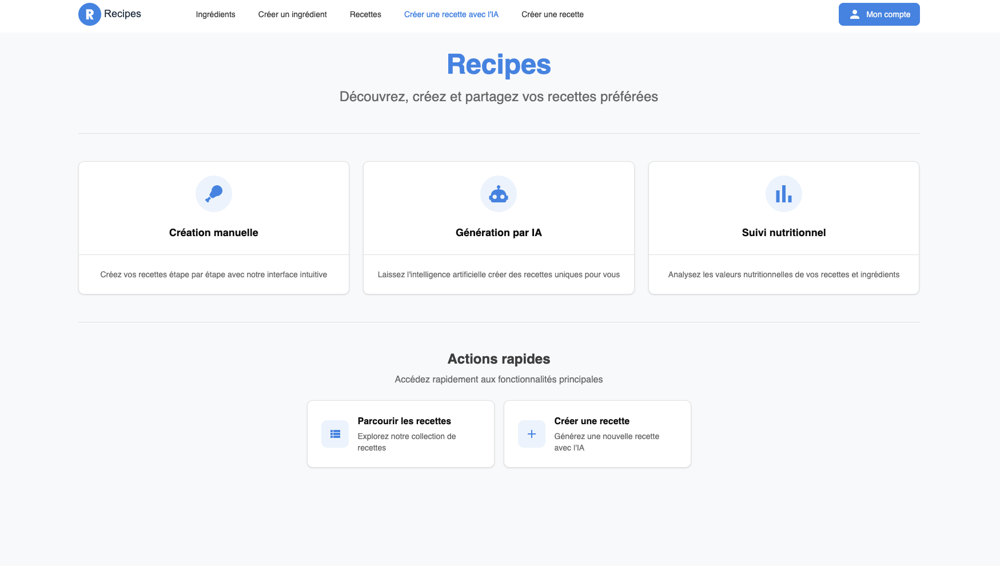

**URL** : `/`

La page d'accueil présente le projet et permet de naviguer vers les différentes sections :
- Présentation du concept
- Liens vers la liste des recettes
- Liens vers la liste des ingrédients
- Accès à l'inscription/connexion

### Liste des recettes
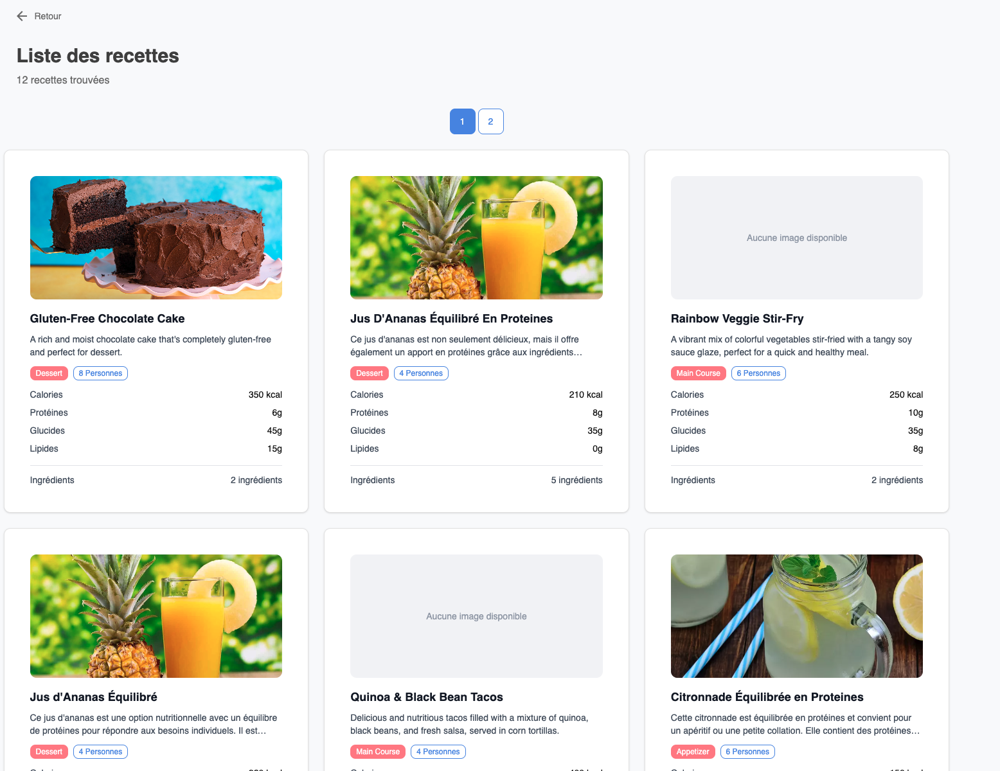

**URL** : `/recipe-list`

- Affichage paginé de toutes les recettes
- Navigation par pages
- Aperçu des recettes avec image et informations nutritionnelles
- Accès aux détails de chaque recette
- **Accessible sans connexion**

### Détails d'une recette
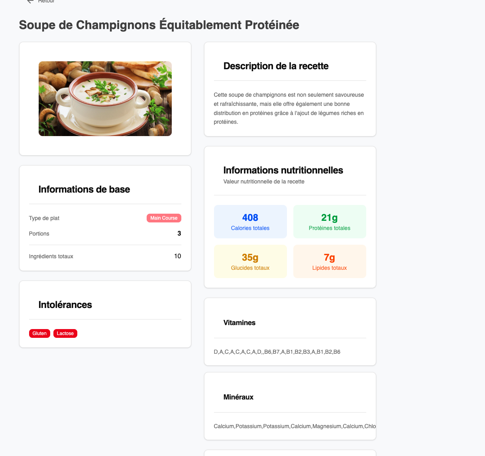

**URL** : `/recipe-details/:recipeId`

- Affichage complet d'une recette
- Informations nutritionnelles détaillées
- Liste des ingrédients
- Instructions de préparation
- **Accessible sans connexion**

### Liste des ingrédients
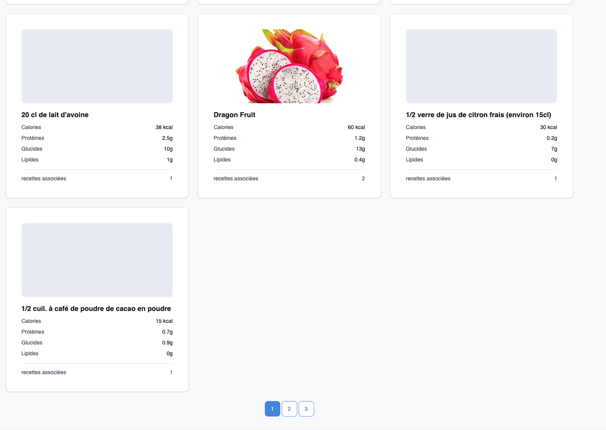

**URL** : `/ingredient-list?page=1`

- Affichage paginé de tous les ingrédients
- Informations nutritionnelles de base
- Accès aux détails de chaque ingrédient
- **Accessible sans connexion**

### Détails d'un ingrédient
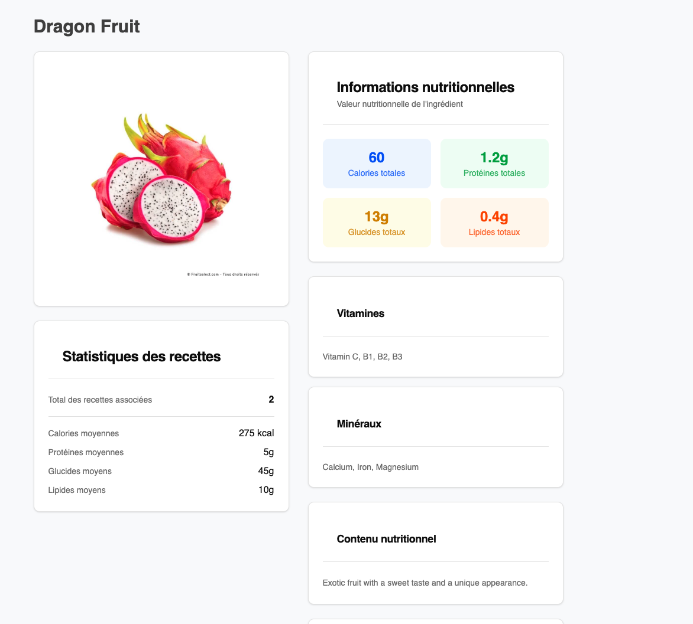

**URL** : `/ingredient-details/:ingredientId`

- Informations nutritionnelles complètes
- Vitamines et minéraux
- Calories et macronutriments
- **Accessible sans connexion**

## 🔐 Authentification

### Connexion

**URL** : `/login`

- Formulaire d'authentification par email/mot de passe
- Redirection automatique vers la page d'accueil après connexion
- Lien vers l'inscription
- Gestion des erreurs de connexion

**Validation** :
- Email valide requis
- Mot de passe : minimum 8 caractères, maximum 100 caractères

### Inscription
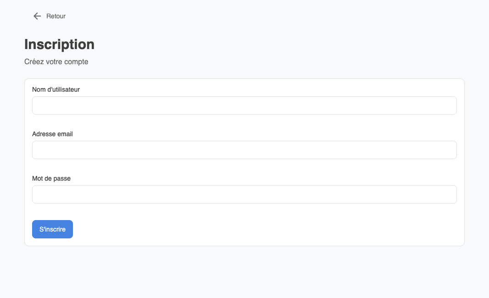

**URL** : `/register`

- Création de compte utilisateur
- Nom d'utilisateur, email et mot de passe requis
- Redirection vers la page de connexion après inscription réussie
- Validation en temps réel des champs

**Validation** :
- Nom d'utilisateur : 5 à 40 caractères
- Email valide et unique
- Mot de passe : 8 à 100 caractères

## 🔒 Pages protégées (connexion requise)

### Profil utilisateur

**URL** : `/profil`

- Affichage des informations du compte
- Fonction de déconnexion
- **Accès protégé** : redirection automatique si non connecté

### Création d'ingrédient
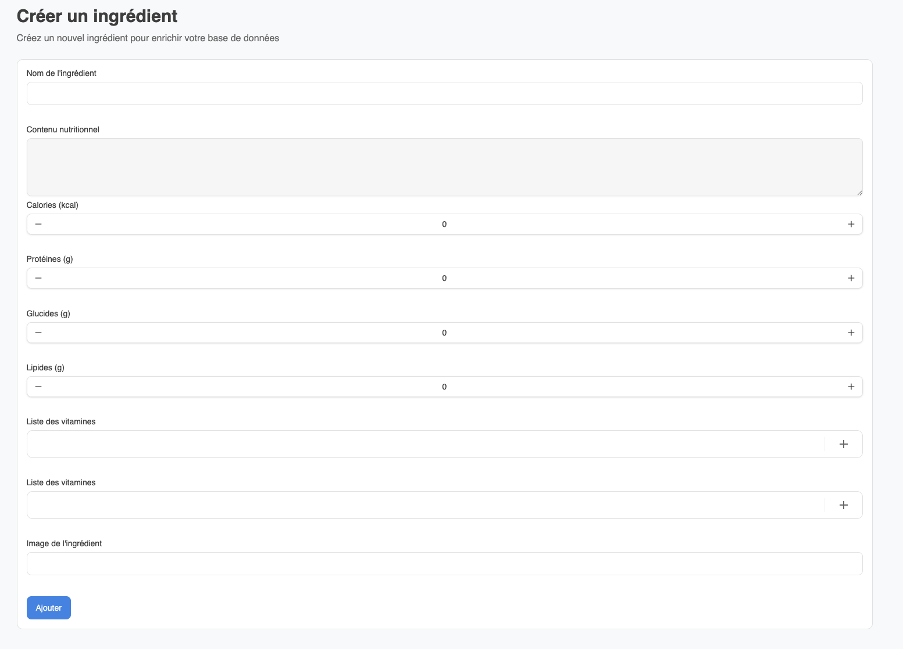

**URL** : `/ingredient-create`

- Formulaire de création d'ingrédient
- Saisie des informations nutritionnelles
- Sélection des vitamines et minéraux
- Upload d'image optionnel
- **Accès protégé**

**Champs requis** :
- Nom de l'ingrédient
- Contenu nutritionnel (description)
- Calories, protéines, glucides, lipides
- Vitamines et minéraux

### Création de recette manuelle
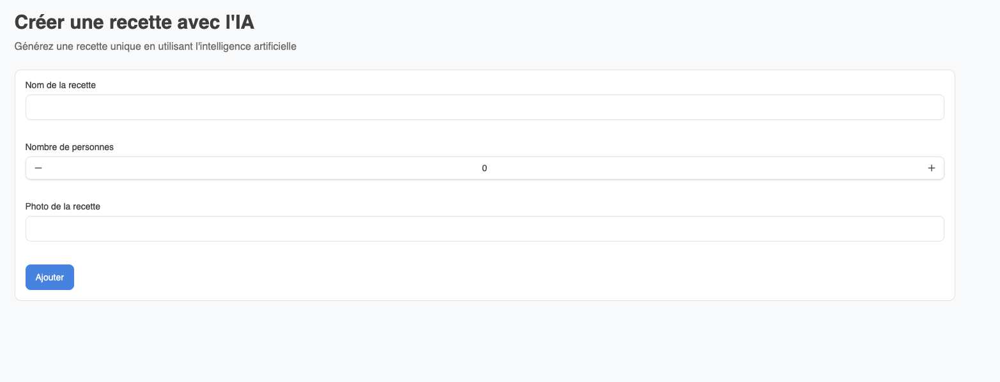

**URL** : `/recipe-create`

- Formulaire complet de création de recette
- Sélection des ingrédients existants
- Saisie des informations nutritionnelles
- Définition du type de plat et intolérances
- **Accès protégé**

### Création de recette avec IA
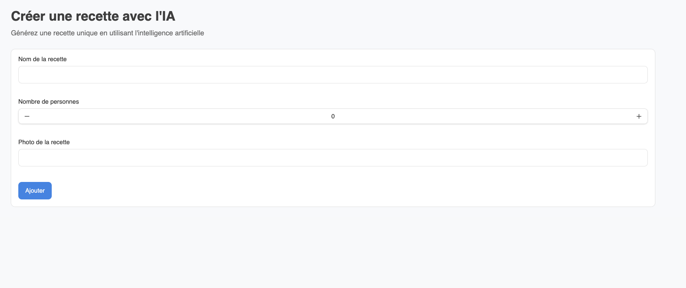

**URL** : `/recipe-create-with-ai`

Cette fonctionnalité unique utilise l'IA Ollama pour générer automatiquement une recette complète.

**Processus** :
1. L'utilisateur saisit :
   - Nom de la recette souhaitée
   - Nombre de personnes
   - URL d'une image pour la recette

2. L'IA génère automatiquement :
   - Liste des ingrédients nécessaires
   - Quantités adaptées au nombre de personnes
   - Instructions de préparation
   - Informations nutritionnelles

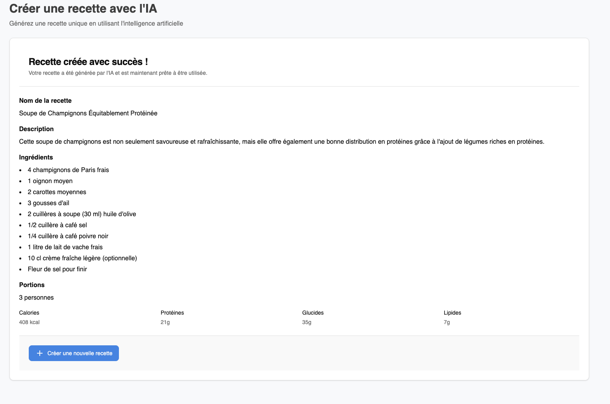
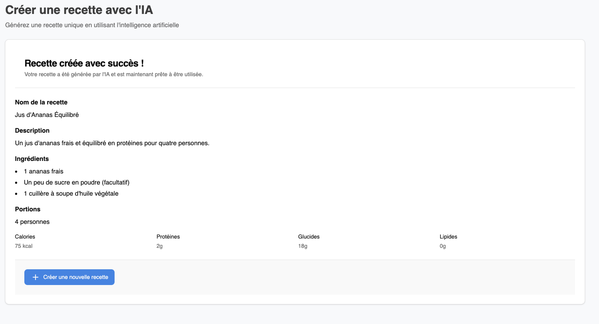

**Avantages** :
- Création rapide et innovante
- Suggestions créatives basées sur l'IA
- Calculs nutritionnels automatiques
- Adaptation automatique des portions

## 🔄 Flux d'authentification

### Utilisateur non connecté
1. **Accès libre** : pages de liste et de détails
2. **Redirection automatique** : tentative d'accès aux pages protégées → page de connexion
3. **Navigation** : header adapté avec boutons de connexion/inscription

### Utilisateur connecté
1. **Accès complet** : toutes les fonctionnalités disponibles
2. **Header personnalisé** : affichage du nom d'utilisateur et lien profil
3. **Déconnexion** : suppression du token et retour aux fonctionnalités publiques

## 🛡️ Sécurité

### Gestion des tokens
- Token JWT stocké en cookie HTTP-only
- Validation automatique côté serveur
- Expiration automatique des sessions
- Vérification des permissions à chaque requête

### Protection des routes
- Middleware de vérification sur le backend (Duplo)
- Vérification du token dans les cookies
- Routes protégées clairement identifiées
- Gestion gracieuse des erreurs d'authentification

## 📱 Expérience utilisateur

### Navigation fluide
- Menu de navigation cohérent
- Retour automatique après actions
- Loading states pendant les opérations
- Messages de feedback utilisateur

### Responsive design
- Interface adaptée mobile et desktop
- Design moderne avec Tailwind CSS
- Composants réutilisables du design system

### Gestion des erreurs
- Messages d'erreur explicites
- Fallbacks en cas de problème réseau
- Validation en temps réel des formulaires

## 🎯 Points clés du parcours

1. **Découverte libre** : consultation des recettes et ingrédients sans inscription
2. **Inscription simple** : processus rapide avec validation claire
3. **Création guidée** : formulaires intuitifs avec aide contextuelle
4. **Innovation IA** : génération automatique de recettes créatives
5. **Sécurité transparente** : protection des données sans friction utilisateur
